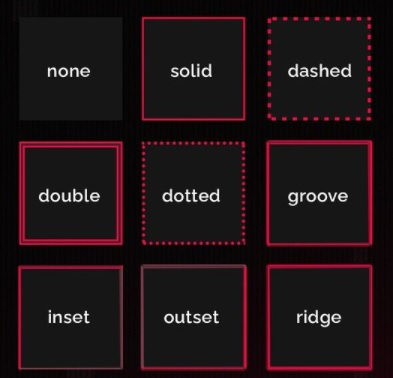

# CSS TRICKS

## CHECKLIST

- [x] BORDER STYLE
- [x] CENTER CONTENT
- [x] CURSOR STYLE
- [x] TEXT GRADIENT

### BORDER STYLE



### CENTER CONTENT

```
.content{
        width: 100%;
        height: 100vh;
        display: flex;
        justify-content: center;
        align-items: center;
}
```

### CURSOR STYLE


### CSS DEBUGGING - TRYING TO CATCH ANY BUG

```
*{
    border: 2px solid red;
}
```

### TEXT GRADIENT

```
.text-gradient{
    display: inline-block;
    color: transparent;
    background-image: linear-gradient(
        90deg,
        #fc87da 0%,
        #cb94ef 26%,
        #41e0e7 70%,
        #28f6c2 100%
    );
    -webkit-background-clip: text;
    background-clip: text;
}
```

### WEBSITES TO LEARN

[Flex Box Froggy](https://flexboxfroggy.com/)
[Evelator Saga](https://play.elevatorsaga.com/)
[Fluke Out](https://flukeout.github.io/)